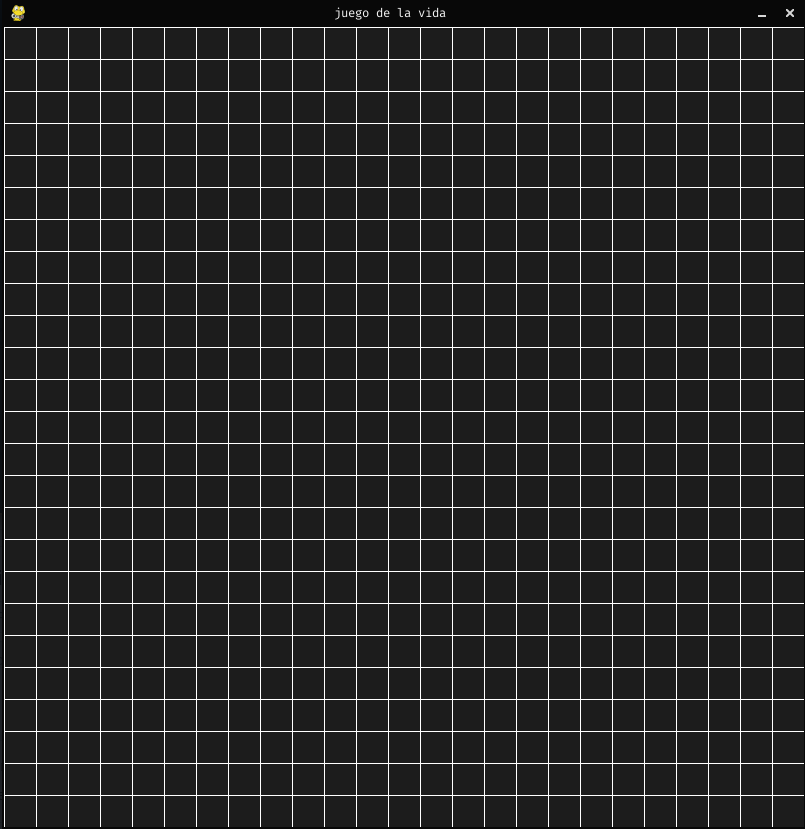
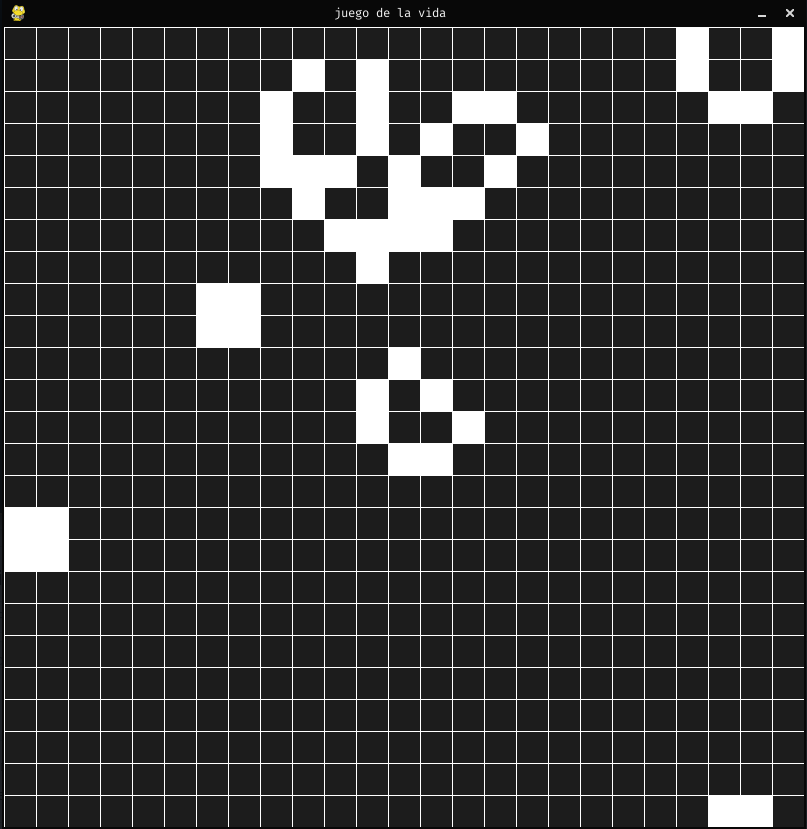
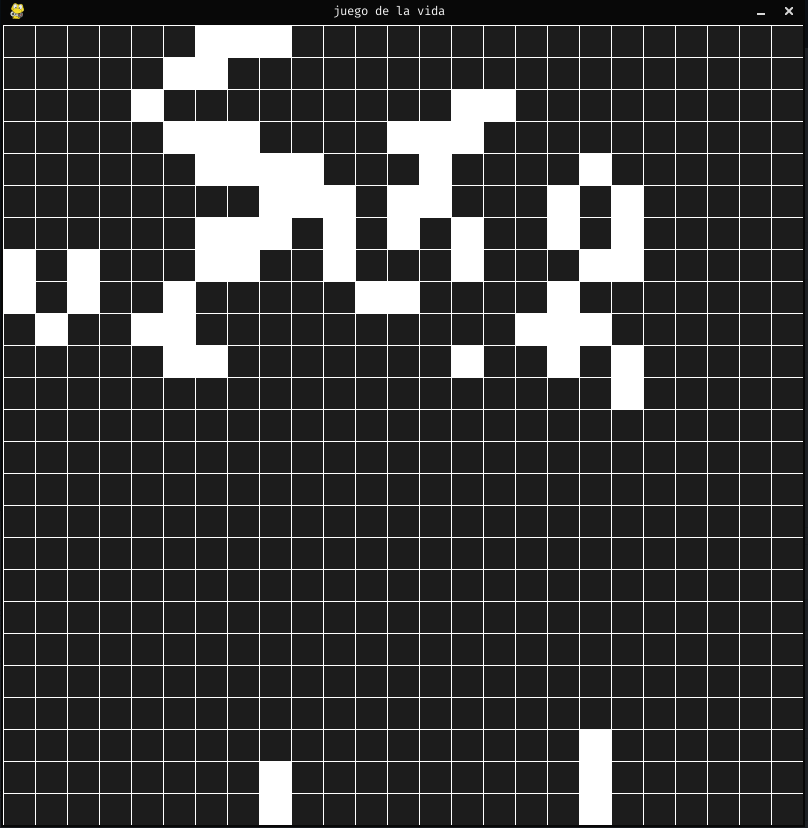
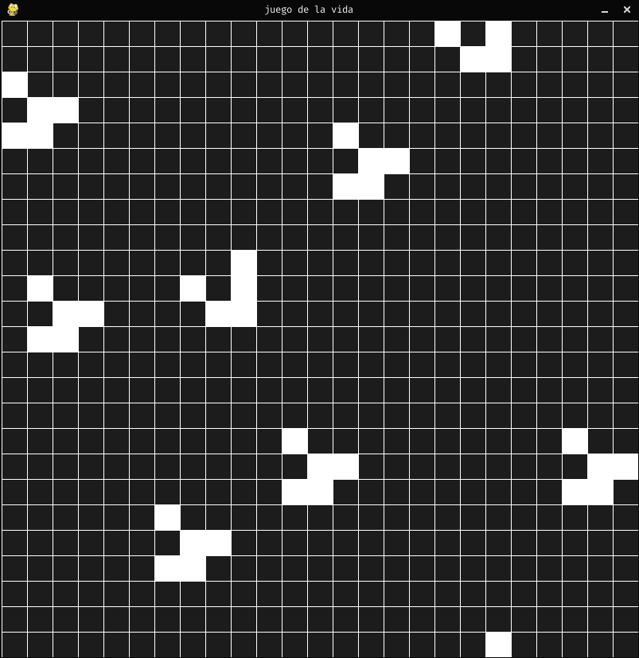
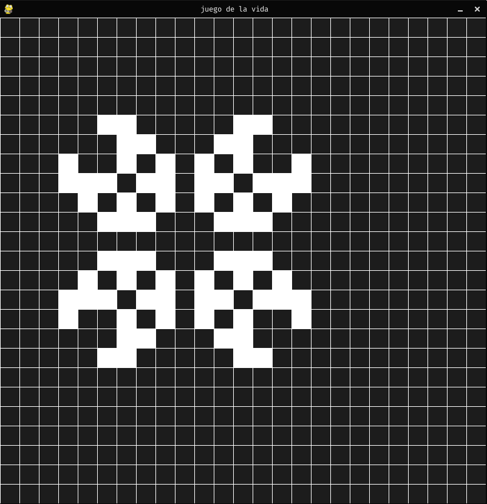

# **Juego de la vida**

### **[+] Iniciar app**
```shell
python3 main.py
```

## **[+] Map**

**acción**      |**comandos**             |
----------------|-------------------------|
cualquier tecla |pause                    |
click izquierdo |dar vida a una célula    |
click derecho   |quitar vida a una célula |

### **[+] Screenshots**






